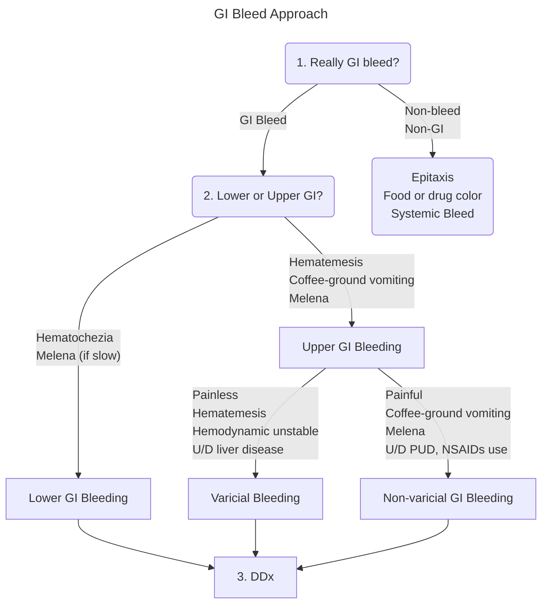

# Definition
Cut off at **ligament of Treitz**
- Prox. → **Upper** GI bleed
- Dist. → **Lower** GI bleed

> ![[Pasted image 20230527093509.png]]
> Ligament of Treitz ~ **Duofeno-jejunal flexure**; do not confuse with foregut-midgut cut-off point

ico cannot determine site of bleed → **obscure GI bleed**

# Approach

# Differential Diagnosis
